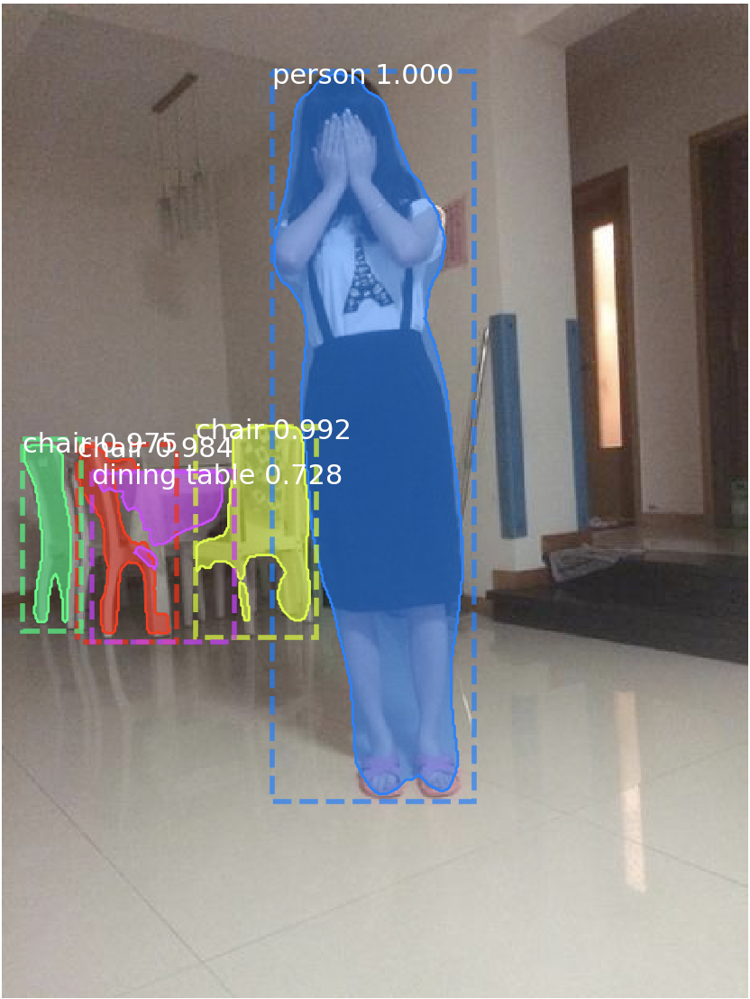
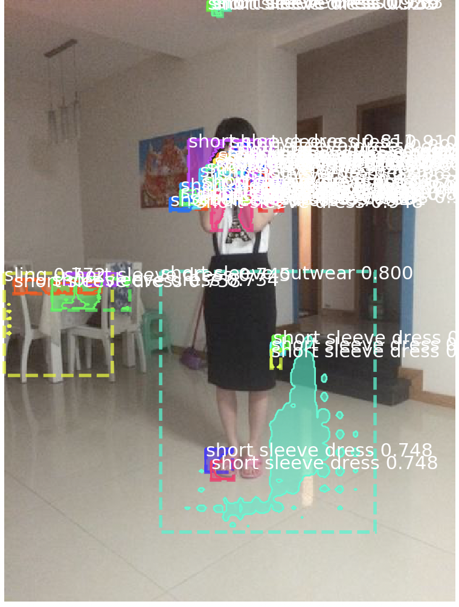
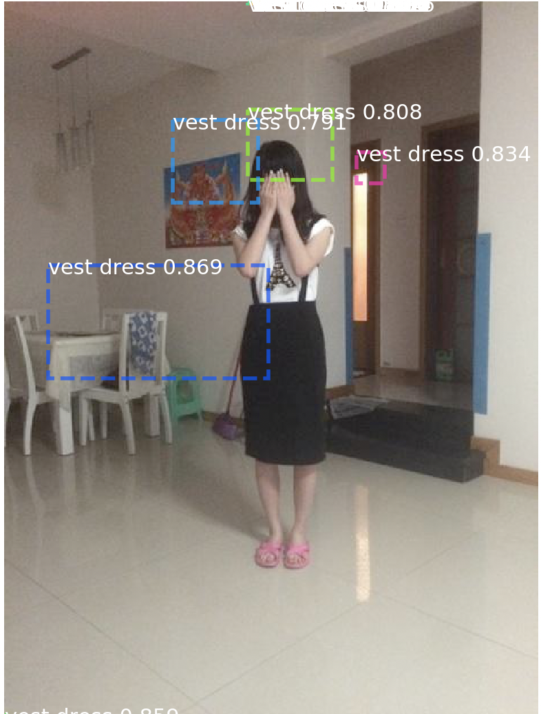

# Learning the Latent Look / Learning the Dress Code
## AUTHORS
Angel Rodriguez(arodri36), Delmy Garcia(dgarci14), Hannah Chow(hchow), Tomi Madarikan(omadari1),

> Usage: python3 fashion.py test --weights mask_rcnn_fashion_0006.h5

### DATA
Deepfashion2[https://github.com/switchablenorms/DeepFashion2], COCO[http://cocodataset.org/#home]

### Intro:
With the new emphasis on the fashion industry’s online, social and personalized
businesses, computer vision is the perfect solution to solve problems related to style models, trend forecasting, interactive search, and recommendation. Maximizing research in this area can improve the ways people shop and what they buy, as well as  increase the understanding and analysis of the fashion industry.We chose to re-implement parts of the paper Learning the Latent “Look”[https://arxiv.org/abs/1707.03376] which attempts to isolate and identify articles of clothing through instance segmentation and their stylistic meaning.

### Methodology
In the original paper, faster-RCNN[https://papers.nips.cc/paper/5638-faster-r-cnn-towards-real-time-object-detection-with-region-proposal-networks.pdf] was used to detect human bodies within the images by cropping the upper and lower halves of the body into individual parts. However, we used Mask-RCNN to detect instances of clothing rather than regions of the body
* Mask-RCNN Model Architecture
    * Composed of Faster_RCNN & FCN
        * Region Proposal Network (RPN), proposes object bounding boxes.
        * Fast R-CNN, extracts features using RoIPool from each candidate box and performs classification and bounding-box regression.
    * FCN Architecture:
        * various blocks of convolution
        * maxpool layers to first decompress an image to 1/32th of its original size.
        * makes a class prediction at this level of granularity.
        * Uses upsampling and deconvolution layers to resize the image to its original dimensions.

### Challenges:
* Figuring out how all of the models were connected
* Fine-tuning our models to work with new datasets
    * Required us to augment existing datasets to fit with model expectations
    * Took a long time with our current computing power (even with GCP GPUs our models could take up to 10 hours to train)
    * Halted the progress towards connecting models because we couldn’t get reliable segmentation
* Trying to learn how to connect the Latent Dirichlet Allocation algorithm to other models to be able to distinguish different attributes (pattern, material, shape, etc.) from images
* Lack of Time and other projects due around checkpoints

### Results:
Original Model 
Our Model after 1 epoch 
Our model after 6 epochs 

Dataset classification:
"Item1": {"category_name": "vest"} "item2": {"category_name": "sling dress"},

#### Problems with Implementation
* Labeling of clothing looks correct but the bounding box and masking is off
* Model isn’t super confident in its predictions
* Some limitations we encountered along the way were figuring out how to set up the initial Latent Dirichlet Allocation (LDA) model as well as how to figure out how to distinguish different attributes (pattern, material, shape, etc.) from that information. After we got past that barrier, we were able to produce the results above, even though they were not entirely accurate.
